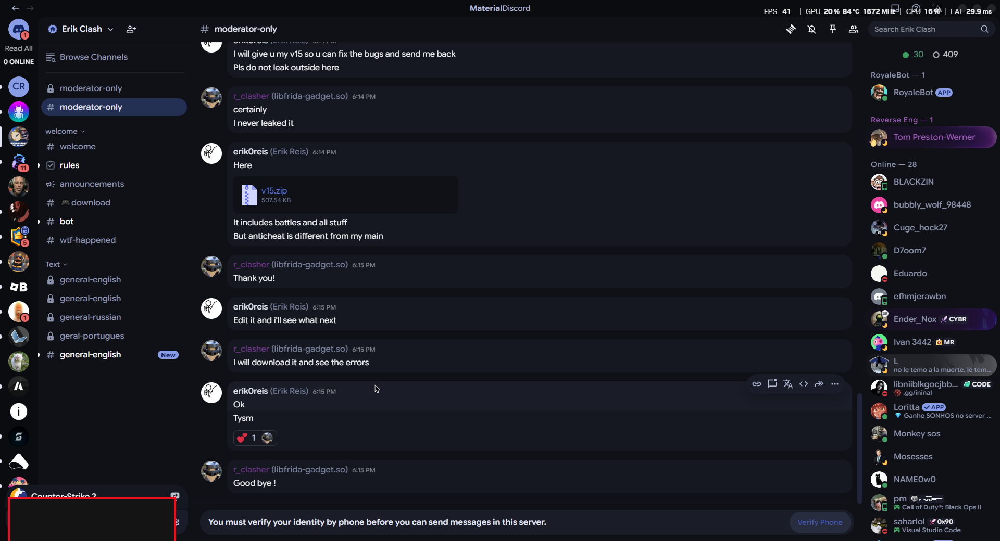

# v15.535.13-ERIK
### Not ready for production.
An archive of Erik Royale for Clash Royale v15.535.13

# Changes (Maleware removal steps)
  ### Credits to **u/sparkygod526** for looking into the repo and removing the malware that 610155670687186948 (Erik Reis) added.
  1. Checked for all files referencing LogicSwapSpellsCommand.js. I found that it was being required and executed in Protocol/MessageFactory.js.
  2. Modified Protocol/MessageFactory.js and removed the following references:
     const LogicSwapSpellsCommand = require("./Commands/Server/LogicSwapSpellsCommand");
     LogicSwapSpellsCommand.configureClient();
  3. I removed the heavily obfuscated malware file located at [./Protocol/Commands/Server/LogicSwapSpellsCommand.js]
  
## YOU MUST HAVE A BRAIN TO USE THIS

## Requirements
* [NodeJS](https://nodejs.org/)
* Brain

## Who Made it?:
 * ChatGPT
 * Claude 100%
 * Deepseek
 * Gemini

## Who Made the prompts?:
* Erik Reis

## Who Leaked it?:
 * Erik's disciple Clasher 🤣
